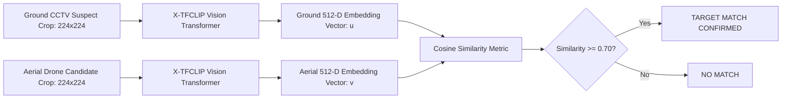

# 🎯 AERO-GUARD: Complete Person Detection, Tracking & Re-ID Guide

> **Comprehensive Technical Specification & Step-by-Step Operational Manual**  
> *YOLO Deep Learning • ByteTrack • BoT-SORT • Point-in-Polygon Geofencing • X-TFCLIP Re-ID • Auto vs. Manual Modes*

---

## 📑 Table of Contents
1. [End-to-End Person Detection Pipeline](#1-end-to-end-person-detection-pipeline)
2. [Dual-Perspective Vision Models (Aerial vs. Ground)](#2-dual-perspective-vision-models-aerial-vs-ground)
3. [Operational Modes: Autonomous (AUTO) vs. Manual (MANUAL)](#3-operational-modes-autonomous-auto-vs-manual-manual)
4. [Multi-Object Tracking & Identity Persistence (ByteTrack & BoT-SORT)](#4-multi-object-tracking--identity-persistence-bytetrack--bot-sort)
5. [Perimeter Geofencing & Intrusion Math (Point-in-Polygon)](#5-perimeter-geofencing--intrusion-math-point-in-polygon)
6. [Cross-Camera Person Re-Identification (X-TFCLIP Transformer)](#6-cross-camera-person-re-identification-x-tfclip-transformer)
7. [Source Code Mapping & File Responsibilities](#7-source-code-mapping--file-responsibilities)

---

## 1. End-to-End Person Detection Pipeline

The person detection pipeline processes incoming video frames at **25–30 frames per second (FPS)** through seven distinct sequential stages:

```mermaid
flowchart TD
    A[Video Source: RTSP / Webcam / MP4 File] --> B[Frame Capture & Letterbox Resize]
    B --> C[YOLO Neural Network Forward Pass]
    C --> D[Non-Maximum Suppression (NMS)]
    D --> E[ByteTrack Multi-Object Tracking & ID Assignment]
    E --> F[Foot-Point Geofence Collision Check]
    F --> G[Threat Classification & Alert Evaluation]
    G --> H[MJPEG Streaming & WebSocket Telemetry Broadcast]
```

### Step-by-Step Processing Stages:
1. **Frame Ingestion**:
   - Captured via OpenCV `cv2.VideoCapture` from RTSP IP streams, local webcams, or uploaded `.mp4` video files.
   - Handled in: [`backend/app/services/streaming/sources/`](file:///Users/mc/Documents/Drone_FYP/backend/app/services/streaming/sources/).
2. **Pre-processing & Letterbox Resizing**:
   - Frames are converted from BGR to RGB color space.
   - Scaled to the model's required input resolution (e.g. $640 \times 640$ pixels) while preserving the original aspect ratio with padding.
3. **Deep Learning Forward Pass**:
   - The PyTorch YOLO backbone extracts spatial feature pyramids across multiple scales (P3, P4, P5) to detect both large and tiny human silhouettes.
   - Handled in: [`backend/app/services/detector/detector.py`](file:///Users/mc/Documents/Drone_FYP/backend/app/services/detector/detector.py).
4. **Bounding Box Decoding & Confidence Filtering**:
   - The model outputs candidate bounding boxes with bounding box coordinates $(x, y, w, h)$ and class probability scores.
   - Predictions with confidence $< \text{threshold}$ (default: $0.45$) are discarded.
5. **Non-Maximum Suppression (NMS)**:
   - Eliminates duplicate overlapping boxes for the same person using Intersection-over-Union (IoU):
     $$\text{IoU} = \frac{\text{Area}(\text{Box}_A \cap \text{Box}_B)}{\text{Area}(\text{Box}_A \cup \text{Box}_B)}$$
   - Boxes with $\text{IoU} > 0.45$ are suppressed, leaving one clean bounding box per person.
6. **Multi-Object Tracking (ByteTrack)**:
   - Associates bounding boxes between consecutive frames to maintain a consistent **Track ID** (e.g., `Person #1`, `Person #19`).
7. **Geofence Point-in-Polygon Check**:
   - The bottom-center coordinate of the bounding box represents the person's feet on the ground $(x_{\text{center}}, y_{\text{bottom}})$.
   - Evaluated against restricted polygon zones using `cv2.pointPolygonTest`.

---

## 2. Dual-Perspective Vision Models (Aerial vs. Ground)

Because human visual features vary radically depending on camera angle, AERO-GUARD uses **two dedicated neural network models**:

| Perspective | Active Model | Checkpoint File | Training Dataset | Specialization & Capabilities |
| :--- | :--- | :--- | :--- | :--- |
| **AERIAL DRONE (`aerial`)** | **YOLO11n VisDrone** | [`backend/models/visdrone_person_best.pt`](file:///Users/mc/Documents/Drone_FYP/backend/models/visdrone_person_best.pt) | VisDrone-DET | • High-altitude top-down perspective (bird's-eye view)<br>• Extremely small body scale (10–30 pixels tall)<br>• Steep camera pitch angles ($45^\circ - 90^\circ$ downward)<br>• Aerial drone movement and motion blur compensation |
| **GROUND CCTV (`ground`)** | **YOLO26n / YOLOv8n** | [`backend/models/yolo26n.pt`](file:///Users/mc/Documents/Drone_FYP/backend/models/yolo26n.pt) | COCO 80-Class | • Horizontal eye-level perimeter security camera view<br>• Full-body human silhouettes with clothing texture extraction<br>• Walking, running, and crouching body poses<br>• Low-light and night-time perimeter lighting |

### Dynamic Model Dispatcher:
When the operator or system toggles between `aerial` and `ground` feeds, [`backend/app/services/inference/dispatcher.py`](file:///Users/mc/Documents/Drone_FYP/backend/app/services/inference/dispatcher.py) dynamically hot-swaps model weights in GPU/CPU memory in under $50\text{ms}$ without restarting the server.

---

## 3. Operational Modes: Autonomous (AUTO) vs. Manual (MANUAL)

```
                       ┌───────────────────────────────────────┐
                       │     PERSON DETECTION & RE-ID MODES    │
                       └───────────────────┬───────────────────┘
                                           │
                 ┌─────────────────────────┴─────────────────────────┐
                 ▼                                                   ▼
     ┌───────────────────────┐                           ┌───────────────────────┐
     │  🤖 AUTONOMOUS MODE   │                           │    👤 MANUAL MODE     │
     │       (`auto`)        │                           │       (`manual`)      │
     └───────────┬───────────┘                           └───────────┬───────────┘
                 │                                                   │
   1. Unmanned 24/7 Monitoring                         1. Security Operator Clicks 'Freeze'
   2. Geofence Zone Breach Detected                    2. Operator Clicks Target Box (#1)
   3. Auto-Crop Suspect High-Res Photo                 3. Operator Clicks 'Save & Commit'
   4. Auto-Calculate 512-D Embedding                   4. Clean Portrait Saved to Gallery
   5. Auto-Relay Reference to Drone Feed               5. Operator Switches to Aerial View
   6. Autonomous Aerial Target Lock                    6. Drone Matches Selected Suspect
```

---

### Mode 1: 🤖 Autonomous Mode (`AUTO`)

#### Objective:
Provide 24/7 unmanned security where perimeter intrusions automatically trigger suspect profiling and aerial drone target locking without requiring any human operator clicks.

#### Step-by-Step Execution:
1. **Continuous Ground Surveillance**:
   - The Ground CCTV camera runs continuous detection on all visible persons.
2. **Automatic Intrusion Trigger**:
   - When a person's foot-point enters a defined restricted polygon geofence, the system elevates threat status to `INTRUSION`.
3. **Automated Evidence Capture**:
   - [`backend/app/services/alert/evidence_recorder.py`](file:///Users/mc/Documents/Drone_FYP/backend/app/services/alert/evidence_recorder.py) automatically extracts a high-resolution, uncompressed crop of the intruder.
   - Saves the photo to `runs/output/snapshots/` and creates a database row in `runs/output/evidence.db`.
4. **Autonomous Re-ID Reference Registration**:
   - The backend's [`ReIDService`](file:///Users/mc/Documents/Drone_FYP/backend/app/services/reid/service.py) automatically registers the intruder's tracklet as the active Re-ID query target.
   - The [X-TFCLIP encoder](file:///Users/mc/Documents/Drone_FYP/backend/app/services/reid/encoder.py) extracts a 512-dimensional visual embedding vector in a background worker process.
5. **Autonomous Aerial Drone Lock**:
   - When the UAV drone patrols the overhead airspace, detected candidate persons are compared against the intruder's embedding.
   - The candidate with the highest cosine similarity exceeding the confidence threshold is automatically highlighted with a golden target lock banner and real-time match percentage.

---

### Mode 2: 👤 Manual Operator Mode (`MANUAL`)

#### Objective:
Empower human security personnel to visually identify a specific suspect on a ground camera, lock their portrait into memory, and track that specific individual across all aerial drone cameras.

#### Step-by-Step Operator Guide:
1. **Step 1 — Freeze the Stream**:
   - On the Ground CCTV view, click the **"Freeze & select suspects"** button located below the video feed.
   - The live MJPEG stream freezes on the current high-resolution frame while preserving all active bounding box coordinates.
2. **Step 2 — Click on the Target Person**:
   - Click on the bounding box of the desired individual (e.g. **Person #1** or **Person #19**).
   - The bounding box border shifts from **tactical green** to **amber gold** (`Selected Suspect`), confirming selection.
3. **Step 3 — Confirm & Save Suspect Portrait**:
   - Click **"Confirm & Save Selection"**.
   - A normalized thumbnail portrait of the suspect appears under the **"Selected suspects"** tray at the bottom of the screen.
4. **Step 4 — Switch to Aerial Airspace View**:
   - Click the **"AERIAL DRONE"** tab in the tactical header or navigate to the `/airspace` route.
5. **Step 5 — View Cross-Camera Matching**:
   - The right-hand **Re-ID Panel** displays the ground suspect's photo on the left side and ranks all live aerial drone candidates on the right side with cosine similarity percentages (e.g., `87.4% MATCH`).

---

## 4. Multi-Object Tracking & Identity Persistence (ByteTrack & BoT-SORT)

Raw object detectors only detect people on isolated frames without remembering who they were in the previous frame. AERO-GUARD uses **ByteTrack** and **BoT-SORT** to maintain persistent identities across video streams.

### How ByteTrack Works:
1. **Kalman Filter State Estimation**:
   - Each tracked person is modeled as an 8-dimensional state vector:
     $$\mathbf{x} = [x, y, a, h, \dot{x}, \dot{y}, \dot{a}, \dot{h}]^T$$
     *(where $x, y$ are bounding box center coordinates, $a$ is aspect ratio, $h$ is height, and $\dot{x}, \dot{y}, \dot{a}, \dot{h}$ are velocity vectors).*
2. **Two-Stage Hungarian Association**:
   - **Stage 1 (High-Confidence Detections)**: Matches high-confidence detections ($\text{conf} \ge 0.50$) with predicted Kalman filter positions using IoU distance.
   - **Stage 2 (Low-Confidence Detections)**: Matches remaining unmatched tracks with low-confidence detections ($0.10 \le \text{conf} < 0.50$) to recover people who are temporarily occluded by trees, gates, or shadows.
3. **Track Lifecycle & Identity Recovery**:
   - If a person is lost behind an obstacle for $< 30$ frames (1 second), their Track ID is preserved upon reappearance rather than assigning a new ID.

---

## 5. Perimeter Geofencing & Intrusion Math (Point-in-Polygon)

Geofencing restricts unauthorized entry into sensitive zones (e.g., entrance gates, perimeters, airfield tarmac).

```
Polygon Zone Vertices: [ (x1,y1), (x2,y2), (x3,y3), (x4,y4) ]
Person Bounding Box: [ x_min, y_min, x_max, y_max ]
Foot Contact Point: P = ( (x_min + x_max)/2, y_max )
```

### Mathematical Formula:
The foot-point coordinate $P(x_f, y_f)$ is tested against the closed polygon $\mathcal{V}$ using the Jordan Curve Theorem implemented in OpenCV `cv2.pointPolygonTest`:

$$\text{result} = \text{cv2.pointPolygonTest}(\mathcal{V}, (x_f, y_f), \text{measureDist}=\text{False})$$

- $\text{result} > 0$: Point is **INSIDE** the restricted zone $\rightarrow$ **INTRUSION ALARM**.
- $\text{result} = 0$: Point is on the zone boundary.
- $\text{result} < 0$: Point is **OUTSIDE** the restricted zone $\rightarrow$ **CLEAR**.

Handled in: [`backend/app/services/zone/zone_monitor.py`](file:///Users/mc/Documents/Drone_FYP/backend/app/services/zone/zone_monitor.py).

---

## 6. Cross-Camera Person Re-Identification (X-TFCLIP Transformer)

When a suspect moves from a fixed ground gate camera into an open field monitored by an aerial drone, their visual appearance changes drastically due to lighting, angle, and distance.



### Feature Extraction & Cosine Similarity:
1. **Crop Normalization**:
   - Suspect crops are resized to $224 \times 224$ pixels and normalized with ImageNet mean and standard deviation:
     $$\mathbf{I}_{\text{norm}} = \frac{\mathbf{I} - \mu}{\sigma}$$
2. **Transformer Encoding**:
   - The X-TFCLIP transformer backbone extracts a compact, $L_2$-normalized 512-dimensional semantic embedding vector $\mathbf{u} \in \mathbb{R}^{512}$ where $\|\mathbf{u}\|_2 = 1$.
3. **Similarity Ranking**:
   - The cosine similarity score between the Ground reference $\mathbf{u}$ and an Aerial candidate $\mathbf{v}$ is computed as:
     $$\text{Similarity}(\mathbf{u}, \mathbf{v}) = \frac{\mathbf{u} \cdot \mathbf{v}}{\|\mathbf{u}\|_2 \|\mathbf{v}\|_2} = \sum_{i=1}^{512} u_i v_i$$
   - Scores are converted to percentage values:
     $$\text{Match Percentage} = \max(0, \min(100, \text{Similarity} \times 100\%))$$

---

## 7. Source Code Mapping & File Responsibilities

| Subsystem | File Path | Function / Responsibility |
| :--- | :--- | :--- |
| **YOLO Detection** | [`backend/app/services/detector/detector.py`](file:///Users/mc/Documents/Drone_FYP/backend/app/services/detector/detector.py) | Executes PyTorch forward pass, filters thresholds, applies NMS, and runs ByteTrack association. |
| **Model Profiles** | [`backend/app/services/inference/profiles.py`](file:///Users/mc/Documents/Drone_FYP/backend/app/services/inference/profiles.py) | Defines resolution, confidence ($0.45$), and tracker parameters for `aerial` vs `ground`. |
| **Model Weights** | [`backend/models/visdrone_person_best.pt`](file:///Users/mc/Documents/Drone_FYP/backend/models/visdrone_person_best.pt)<br>[`backend/models/yolo26n.pt`](file:///Users/mc/Documents/Drone_FYP/backend/models/yolo26n.pt) | Checkpoint binary weights for VisDrone UAV detection and COCO ground CCTV detection. |
| **Geofencing** | [`backend/app/services/zone/zone_monitor.py`](file:///Users/mc/Documents/Drone_FYP/backend/app/services/zone/zone_monitor.py) | Executes `cv2.pointPolygonTest` on foot coordinates against restricted polygon vertices. |
| **Re-ID Transformer** | [`backend/app/services/reid/encoder.py`](file:///Users/mc/Documents/Drone_FYP/backend/app/services/reid/encoder.py) | Loads X-TFCLIP model and computes 512-D visual feature vectors. |
| **Re-ID Matcher** | [`backend/app/services/reid/service.py`](file:///Users/mc/Documents/Drone_FYP/backend/app/services/reid/service.py) | Manages suspect galleries, tracklet queues, and cosine similarity rankings. |
| **Auto Snapshot** | [`backend/app/services/alert/evidence_recorder.py`](file:///Users/mc/Documents/Drone_FYP/backend/app/services/alert/evidence_recorder.py) | Saves high-res JPEG intruder snapshot photos to `runs/output/snapshots/`. |
| **Manual Selection UI** | [`frontend/src/components/tactical/VideoViewport/SuspectSnapshots.tsx`](file:///Users/mc/Documents/Drone_FYP/frontend/src/components/tactical/VideoViewport/SuspectSnapshots.tsx) | Renders suspect portrait gallery, freeze triggers, and download buttons. |
| **Selection Hook** | [`frontend/src/hooks/useSuspectSelection.ts`](file:///Users/mc/Documents/Drone_FYP/frontend/src/hooks/useSuspectSelection.ts) | Manages freeze frame state, interactive bounding box hit-testing, and API selection commit. |
| **Re-ID Gallery UI** | [`frontend/src/components/tactical/ReIDPanel/ReIDPanel.tsx`](file:///Users/mc/Documents/Drone_FYP/frontend/src/components/tactical/ReIDPanel/ReIDPanel.tsx) | Displays Ground query suspect on the left and ranked Aerial matching candidates on the right. |
